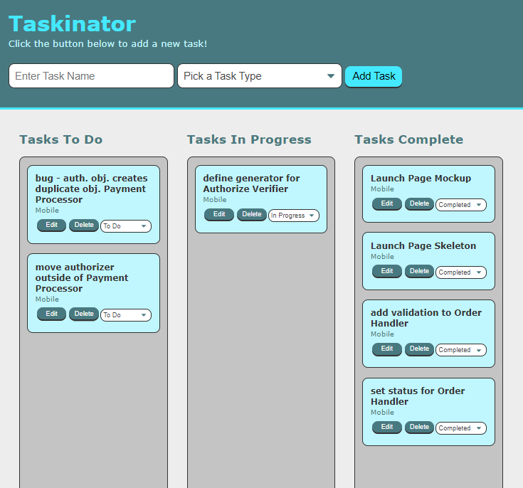

# Taskinator

## Description

A simple kanban-style task management app.

## Built With

## Website
[Let's Get Tasking!](https://scottrohrig.github.io/taskinator/)

## Features
- Three-column Layout
    - To Do
    - In Progress
    - Completed
- Add, Edit, Delete & Move Tasks

### ©️2020 Taskinator 
